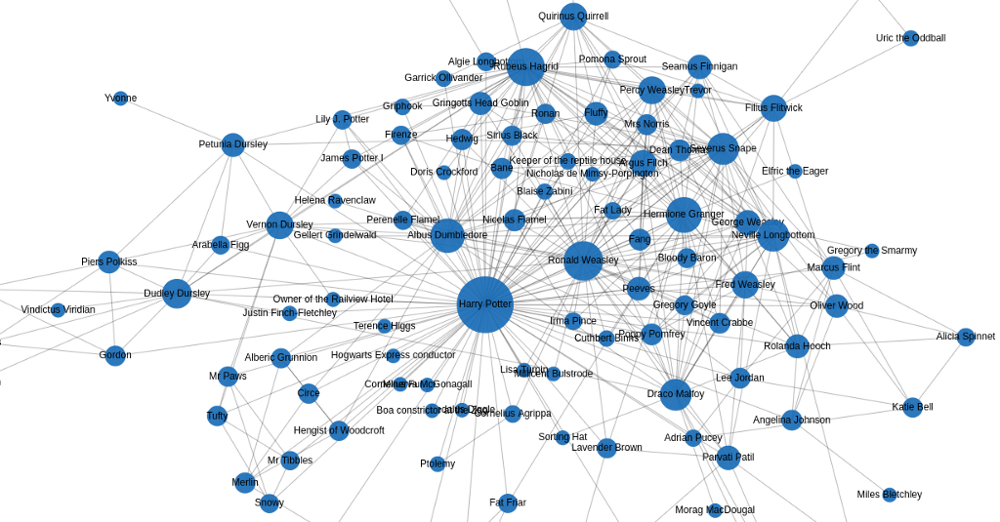
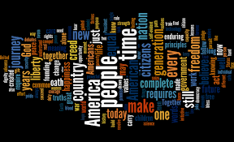

# Natural Language Processing
Natural Language Processing (NLP) is an artificial intelligence (AI) that aids computer in *comprehending*, *interpreting*, and *manipulating* human language.

NLP isn't a new subject, but it's progressing quickly thanks to a growing interest in human-machine communication, as well as the availability of massive data, powerful computation, and improved algorithms.

## 10 Best NLP Algorithms
Human language is complex by nature. A technology must grasp not just grammatical rules, meaning, and context, but also colloquialisms, slang, and acronyms used in a language to interpret human speech. NLP algorithms aid computers by  emulating human language comprehension.

---
## 1. Lemmatization and Stemming
- This works nicely with a variety of other morphological variations of a word.
- Allow to limit a single word's variability to a single root.
  - e.g: Reduce `singer, singing, sang and sang` to a singular version of word `sing`.
  - Reduce data space required and construct more powerful and robust NLP algorithms by doing this to all the terms in a document or text
- Pre-processing techniques -> employ one of the two NLP algorithms based on needs before moving forward with NLP to free up data space and prepare the database
- Both are extremely diverse procedures that can be done in a variety of ways, but the end effect is the same for both: `a reduced search area for the problem we're dealing with`.

### Difference between Lemmatization and Stemming

| Lemmatization                                                             | Stemming                                                                                                          |
| ------------------------------------------------------------------------- | ----------------------------------------------------------------------------------------------------------------- |
| - Considers the context and converts the word to its meaningful base form | - Process that stems or removes last few characters from a word, often leading to incorrect meanings and spelling |
| - Lemmatizing the word `Caring` would return `Care`                       | - Stemming the word `Caring` would return `Car`                                                                   |
| - Computationally expensive since it involves look-up tables and what not | - Used in case of large dataset where performance is an issue                                                     |

### Use Case for Lemmatization
- `Search Engine Optimization`
  - Help respond to queries in the best possible way. 
- `Sentiment Analysis`
  - To better understand the user's sentiments in a message
- `Information Retrieval`
  - can easily retrieve information and group similar data

### Pros and Cons of Lemmatization
| Pros                                                                                                                            | Cons                                                                                                             |
| ------------------------------------------------------------------------------------------------------------------------------- | ---------------------------------------------------------------------------------------------------------------- |
| - Help better understanding of the text and provides accurate results by understanding the context in which the words are used | - Slow and time-consuming process because it uses a dictionary to conduct a morphological of the inflected words |
---

## 2. Topic Modelling
- Type of NLP in which it try to find `abstract subjects` that can be used to define a text set. This implies that we have a corpus of text and are attempting to uncover word and phrase trends that will aid us in `organizing` and `categorizing` the documents into `themes`
- `Latent Dirichlet Allocation`:
  - Construct a list of subjects to which your collection of documents can be applied
- Assign a text to a random subject in dataset at first, then go over the sample several times, enhance the concept, and reassign documents to different themes

### Use Case for Topic Modelling
The application has become diverse with `supervised, unsupervised, and semi-supervised` approaches being modified and invented to apply in the `text mining, text classification, machine learning, information retrieval, and recommendation engines`
- `Document repositories with textual information or data`
  - Information retrieval includes - representation of documents, queries, the framework, and the ranking system.
  - Utilizes by search engines like **Google**, **Bing** to provide appropriate information basis the user query
- `Clear textual classification`
  - Use in the database of genomics which have vast amount of textual content.
  - Search engines for genomics collate and present relevant information as per use queries

<!-- ### Pros and Cons of Topic Modelling -->
<!-- |Pros|Cons| -->
<!-- |---|---| -->
<!-- | -->

---

## 3. Keyword Extraction
One of the most important tasks in NLP, responsible for determining various methods for extracting a significant number of words and phrases from a collections of texts. All of this is done to summarize and assist in the relevant and well-organized organization, storage, search, and retrieval of content.

There are numerous keyword extraction algorithms available, each employs a unique set of fundamental and theoretical methods to this type of problem.

There are some algorithms that extract only words and others which extract both words and phrase. Ther are also that extract keywords based on the complete content of the texts, and algorithms that extract keywords based on the entire content of the texts.

Prominent keyword extraction algorithms:
- `TextRank` -> Operates on the same ideas as `PageRank`. Google uses this method to rank the importance of various websites on the internet
- `Team Frequency` -> Different name is **Term Frequency - Inverse Document Frequency** (TF-IDF), which tries to better define the importance of a term in a document. Also take into account the relationships between texts from the same corpus
- `RAKE` -> Stands for `Rapid Automatic keywords Extraction` and can extract keywords and key phrases from a single document's content without taking into account other documents in the same collection

### Use Case of Keyword Extraction
- `Social media monitoring`
  - Give concrete examples of what people says about certain products
- `Brand monitoring`
  - Easily identify the most important words and phrases mentioned by users, and obtain interesting insights and keys for product improvement
- `Customer service`
  - Automate the ticket tagging process, saving a dozen of hours that they could use to focus on actually solving issues
- `Customer feedback`
  - Easily identify the most representative words and phrases in customer responses, without having to go through each of them manually
- `Business intelligence`
  - Help to understand public opinion towards a topical issue and how it evolves over time
- `Search engine optimization (SEO)`
  - Automatically sift through website content and extract their most frequent keywords
- `Product analytics`
  - Automatically find new opportunities for improvement by detecting frequent terms or phrases mentioned by customets
- `Knowledge management`
  - Enables all industries to uncover new knowledge by making it easy to search, manage, and access relevant content

---

## 4. Knowledge Graphs
Collection of three items: `a subject`, `a predicate` and `an entity that explain a method of storing information using triples`.

The subject of approaches for extracting knowledge-getting ordered information from unstructured documents includes awareness graphs.

Building a knowledge graph requires a variety of NLP techniques and employing more of these approaches will likely result in a more thorough and effective knowledge graph

### Use Case of Knowledge Graphs
- `Financial Analytics`
- `Income Tax Calculations`
- `Financial Reporting`

---

## 5. Words Cloud
Sometimes known as a `tag cloud` is data visualization approach. Words from a text are displayed in a table, with most significant terms printed in larger letters and less important words depicted in a smaller sizes or not visible at all.

Before Applying other NLP, use this to describe the findings

### Use Case of Words Cloud
- `Understanding client issues`
  - Quickly visualize what is the trend of the product
- `Quickening business actions`
  - Make the talking points appear the most frequently
- `Analyzing employee sentiment`
  - Know about point in which the discussion rate is high
- `Simplifying technical data`
  - Share the finding in a more accessible and engaging way
- `Searching for patterns in data`
  - Easy spotting of the data that are overlapping and overpowering
- `Search engine optimization`
  - Helps in SEO algorithms in searching for website

---

## 6. Named Entity Recognition
In charge of classifying and categorizing persons in unstructured text into a set of predetermined groups. Includes `individuals, groups, dates, amounts of money, and so on`

Two sub-step to named entity recognition:-
- `Named Entity Identification`
- `Named Entity Classification`

### Use Case of Named Entity Recognition
- `Classifying content for news providers`
  - Automatically scan entire articles and reveal which are the major people , organizations, and places discussed in them
- `Efficient Search Algorithms`
  - Search term will be matched with only small list of entities in each article leading to faster search execution
- `Powering Content Recommendations`
  - Automating the recommendation process
- `Customer Support`
  - Pull the information and categorize the complaint and assign it to the relevant place
- `Research Papers`
  - Segregating the papers on the basis of the relevant entities it holds

---

## 7. Sentiment Analysis

---

## 8. Text Summarization

---

## 9. Bag of Words

---

## 10. Tokenization
